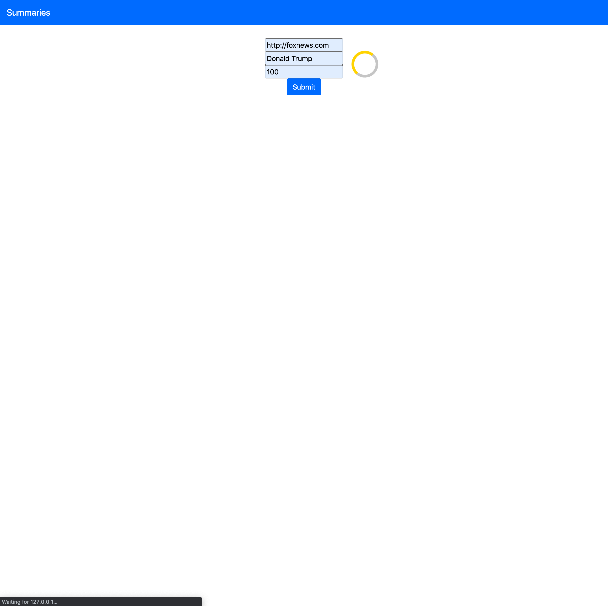
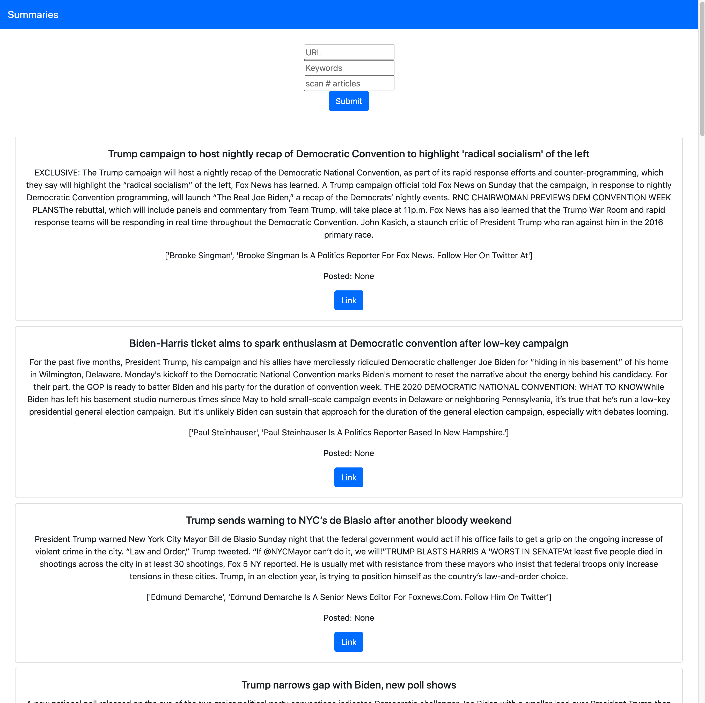

# News Bot

The best way to gather info on a current topic through any news source.

## Example:

### Search

### Results

## What is it:
A simple, powerful news scraper.

* Scrape up to ~1000 articles on a website.
* Check for your keywords
* **Returns a summary of each of those articles.**

[Try Me](https://news-summary-bot.herokuapp.com/)

:bulb: **Note: Currently, the deployed version is giving me a 'timeout error' which I need to find a way to bypass because it does take a minute to loop through all the articles. SO if you want to use it, download this repo. then run `flask run` and go to the local host server shown and voila.**

## How to use it:
Enter the url of the website.
The API's powerful library downloads every article on the site.

Enter the keywords you're looking for.
We search through the keywords of each article to find a match.

Enter then number of articles to scan.
Most news sites are churning out articles, this API can quickly retrieve around 1000 articles.

#### Technologies:
Newspaper3k API
Flask, Python, Html, CSS, Bootstrap
